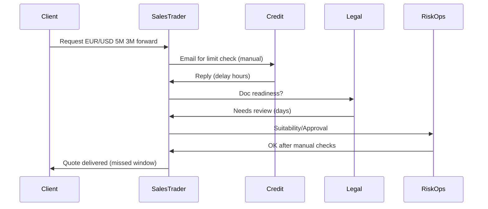
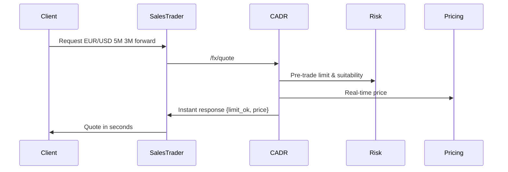
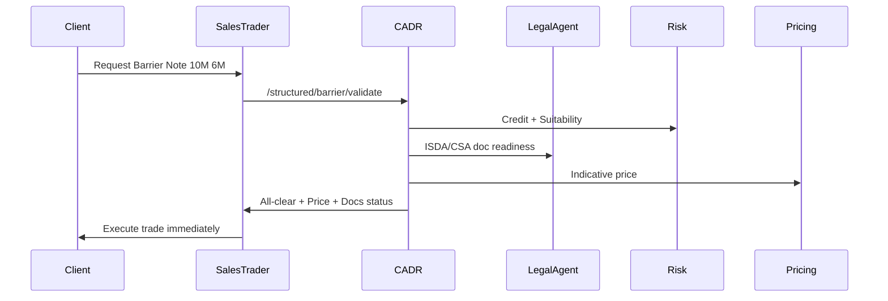

# Cross Asset Deal Rail (CADR) — Sales Pitch Script

**Slide Title:** Cross Asset Deal Rail (CADR): Real-Time Client Decisioning & Execution

**Opening Hook:**  
"Our biggest enemy isn’t the market. It’s our own latency. Clients don’t wait for us to paper docs, check credit, or argue across desks. CADR changes that."

**Key Problems Today:**  
- Legal docs (ISDA / CSA / Annexes) stall trades for days.  
- Sales quotes blind because credit limits aren’t visible pre-trade.  
- Every desk (FX, OTC, Structured) runs approvals differently — chaos in process, lost flow.

**The CADR Promise:**  
A single deal rail that handles underwriting, pre-trade checks, and product suitability across FX, OTC, and Structured — in milliseconds, not days.

**Value to Sales/Advisors:**  
- Speed: Instant Yes/No/Maybe signals.  
- Transparency: Pre-trade limits exposed in trader screens.  
- Consistency: One approval logic across desks.  
- Client Impact: Faster quotes, higher hit rates, stronger retention.

**Tagline:** Stop waiting. Start winning.

# Cross Asset Deal Rail (CADR) — Confluence Blueprint

## Executive Summary
CADR is a unified API and workflow rail that starts with underwriting automation and scales to full trade enablement across FX, OTC, and Structured Products.

## Vision
- Client First: Cut trade approval from days to seconds.  
- Cross Asset: Replace siloed approval systems with a unified rail.  
- Control with Speed: Risk enforced consistently without slowing sales.  
- Future Proof: Extensible architecture.

## Architecture
- API Gateway: Unified entry point across desks.  
- Microservices: Risk, Doc, Compliance, Pricing.  
- Event Backbone: Kafka + Airflow orchestration.  
- Agent Layer: Bedrock AI Agents.  
- Data Mesh: Real-time limits across desks.

## Example Endpoints
- /underwriting/score  
- /fx/quote  
- /otc/swap/indicative  
- /structured/barrier/validate  
- /status/{tradeId}

## Rollout Plan
1. M1–M6: Underwriting + Pre-trade limit checks  
2. M6–M9: FX Spot/Forward  
3. M9–M15: OTC + Structured execution  
4. M15+: Cross-asset portfolio monitoring

## Stakeholder Benefits
- Sales Traders: Instant capacity visibility.  
- Advisors: Single portal, multi-product.  
- Risk: Unified controls, auditable.  
- Clients: Faster turnaround, more access.

# Workflow Diagrams — Before vs After

## FX Spot/Forward (Before)

## FX Spot/Forward (After CADR)

## OTC / Structured Note (After CADR)

