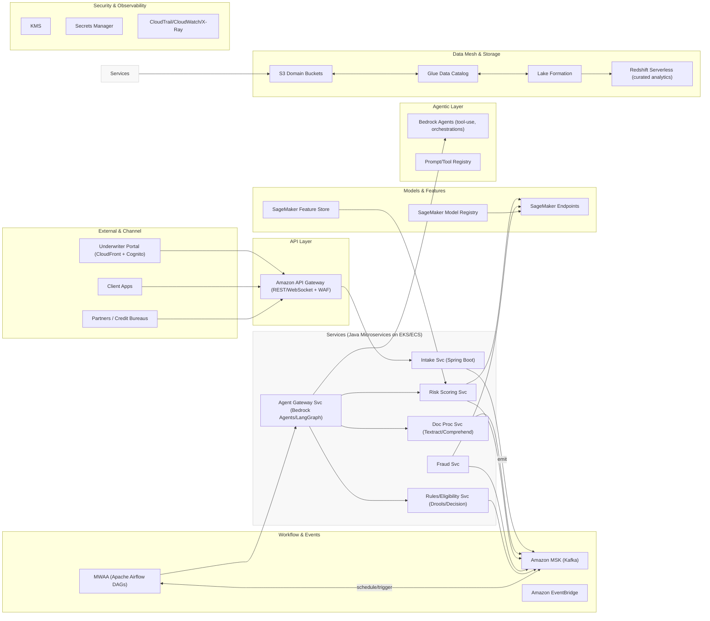
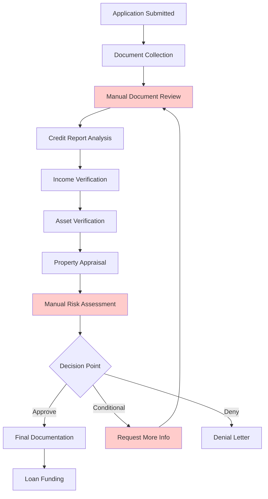
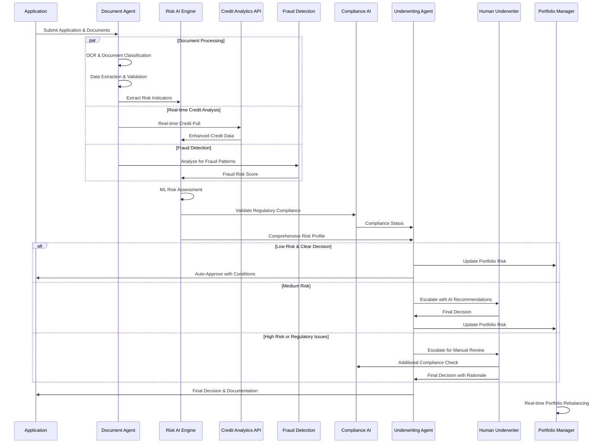
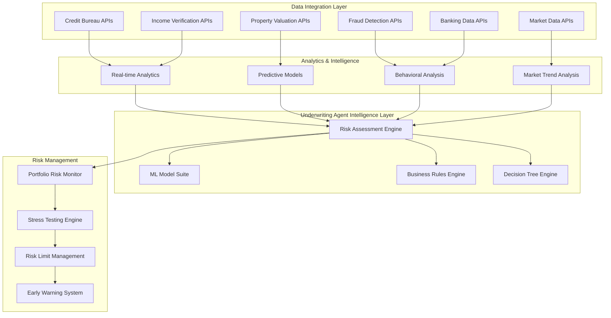
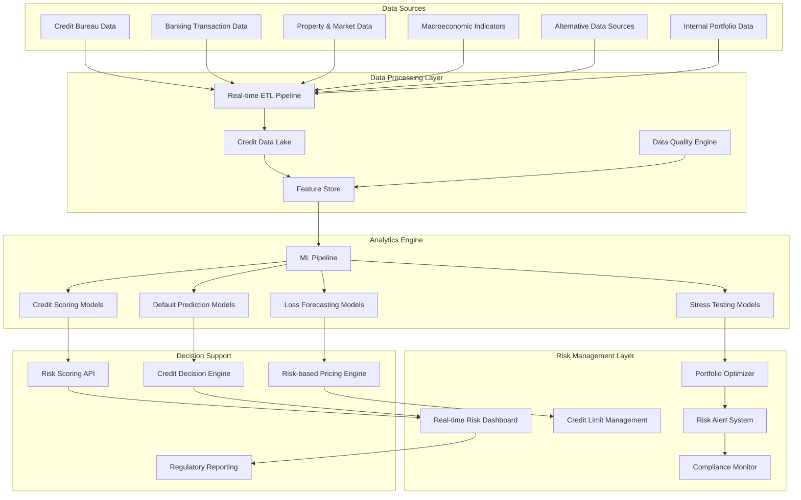
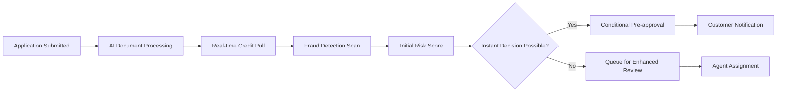
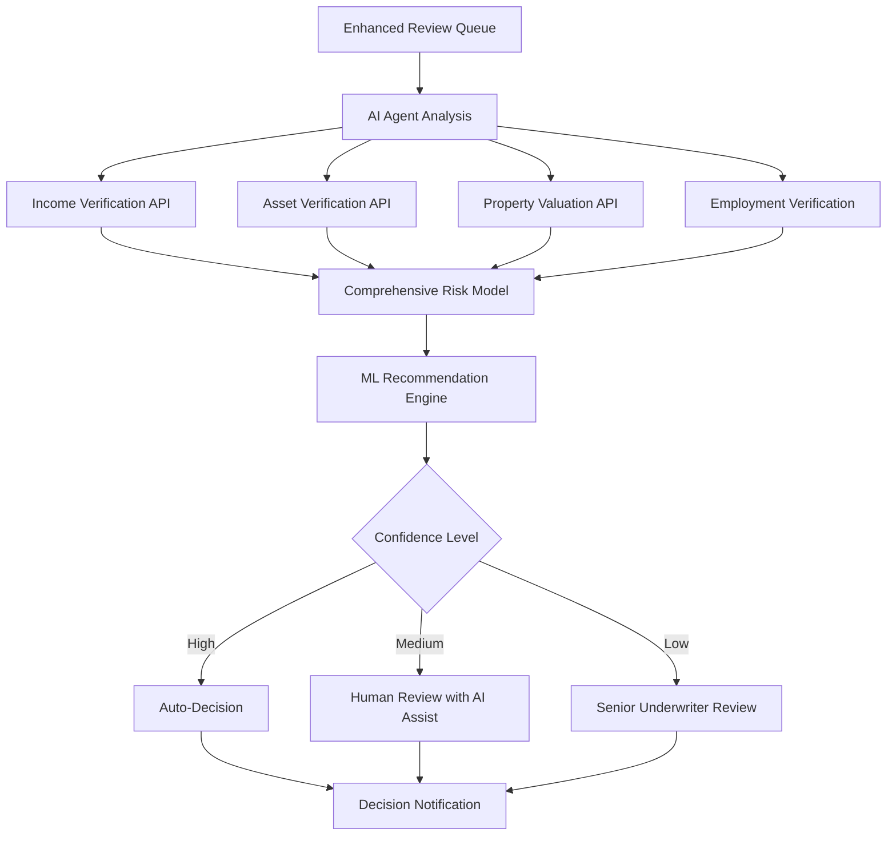
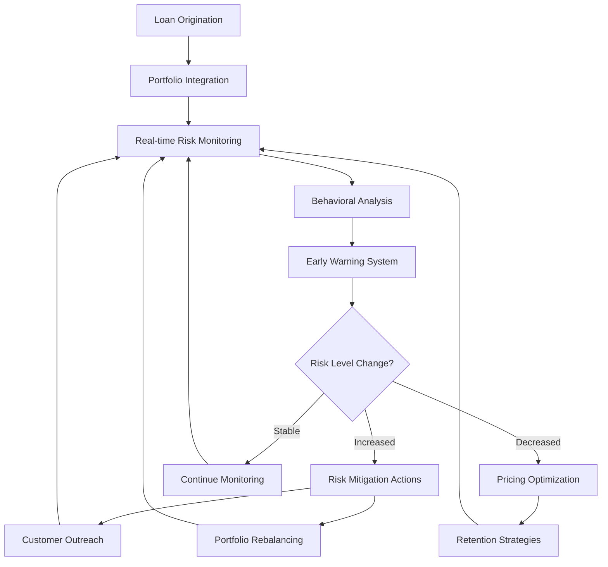
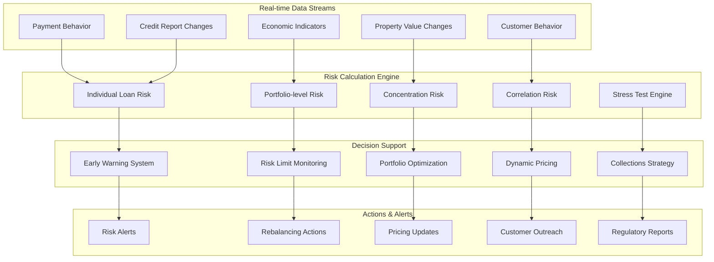

# Underwriting Re‑engineering — **AWS + Kafka + Data Mesh + Agentic Orchestration + Java Microservices**  
_Last updated: 2025-09-30 04:34_

## Executive Summary (AWS-Native, Production-Ready)
We implement underwriting as a **domain-aligned, event-driven, agentic system** on AWS:
- **Agent Orchestration**: Bedrock Agents (for tool-use & reasoning) + LangGraph (optional) federated via **Amazon API Gateway** and **Java microservices** on **Amazon EKS** (or ECS Fargate) for deterministic control.
- **Modeling & MLOps**: **Amazon SageMaker** (Feature Store, Pipelines, Model Registry, Endpoints), experiments tracked and promoted through gated stages.
- **Workflow Orchestration**: **Amazon MWAA (Managed Airflow)** for long-running document workflows, SLAs, retries, backfills; Airflow triggers agent tasks and microservices.
- **Event Backbone**: **Amazon MSK (Kafka)** with domain topics, schemas, and DLQs; **Amazon EventBridge** for async fan-out and alarm routing.
- **Data Mesh**: Domain S3 buckets + **AWS Glue Data Catalog** + **Lake Formation** for permissions; producer/consumer contracts per domain; cross-account sharing; row/column-level controls.
- **APIs & Integrations**: **API Gateway** (REST + WebSocket) fronting public/partner APIs and internal service mesh (EKS + App Mesh), with **WAF** and **JWT**.
- **Security & Governance**: **KMS**, **Secrets Manager**, **CloudTrail**, **GuardDuty**, **AWS IAM** ABAC, **Config**, **Audit** stores; prompt/response tracing for all agent decisions.
- **Observability**: **CloudWatch**, **OpenTelemetry**, **X-Ray**, **SageMaker Model Monitor**, Airflow SLA miss alerts, and Kafka consumer lag alarms.
- **Human-in-the-Loop**: Underwriter Portal (CloudFront + Cognito + ALB) for queueing, override & explanation review.

---

## Reference Architecture (Mermaid)



---

## Data Mesh Contract
- **Producers** (e.g., *Underwriting-Intake*, *KYC*, *Credit Bureau Ingest*) publish to **MSK** topics:  
  - `uw.intake.apps` (PII-masked envelope)  
  - `uw.docs.processed` (structured extraction + embeddings ref)  
  - `uw.risk.scores` (score + version + explainer ref)  
  - `uw.decision.outcomes` (approve/decline/pend + reason codes)
- **Schema Strategy**: Avro/JSON Schema in **Glue Schema Registry**. Backward-compatible evolution; schema fingerprinting on publish.
- **Storage**: S3 domain buckets per team with **Lake Formation** permissions; Iceberg/Parquet for curated zones.
- **Sharing**: Cross-account LF grants; **Data Product Catalog** tag-based discovery; cost & lineage in **AWS Billing + AWS Glue + OpenLineage**.

---

## Agent Orchestration
- **Bedrock Agents** for tool-use (calling Java microservices via API Gateway) and retrieval (Knowledge Bases over S3/Opensearch).  
- **Patterns**:  
  1) *Document Triage Agent* → Textract/Comprehend > DocSvc > Airflow continuation.  
  2) *Risk Agent* → Feature fetch (SageMaker Feature Store) → invoke risk endpoint → produce reason codes.  
  3) *Compliance Agent* → RulesSvc + policy prompts with grounding docs → escalate via Portal.
- **Guardrails**: Prompt templates with PII redaction, model content filters, policy pinning, and **Bedrock Guardrails**; all agent calls recorded (inputs/outputs, tool-use, version).

---

## Java Microservices (Spring Boot on EKS/ECS)
- **Core Services**: IntakeSvc, DocSvc, RiskSvc, FraudSvc, RulesSvc, AgentSvc (minimal state, idempotent).  
- **Infra**: EKS + **App Mesh** (mTLS), **Horizontal Pod Autoscaler**, **Karpenter** autoscaling.  
- **CI/CD**: CodeCommit/CodeBuild/CodePipeline or GitHub Actions → ECR → Blue/Green via Argo Rollouts.
- **Contracts**: REST (OpenAPI), async MSK consumers; idempotency keys and outbox pattern for exactly-once semantics.

**Sample Spring Boot Controller (call SageMaker):**
```java
@RestController
@RequestMapping("/risk")
public class RiskController {
  private final SageMakerClient sm; // wrapper using AWS SDK v2
  @PostMapping("/score")
  public ResponseEntity<RiskScore> score(@RequestBody UnderwritingApp app) {
    var features = FeatureMapper.from(app); // pull from Feature Store if needed
    var result = sm.invokeEndpoint("risk-endpoint", features);
    return ResponseEntity.ok(result);
  }
}
```

---

## Airflow (MWAA) — Underwriting DAG Skeleton
```python
from airflow import DAG
from airflow.providers.amazon.aws.operators.lambda_function import LambdaInvokeFunctionOperator
from airflow.providers.apache.kafka.sensors.kafka import AwaitMessageSensor
from datetime import datetime, timedelta

with DAG(
    dag_id="uw_application_flow",
    start_date=datetime(2025, 1, 1),
    schedule=None,
    catchup=False,
    dagrun_timeout=timedelta(hours=6),
    default_args={"retries": 3, "retry_delay": timedelta(minutes=5)}
) as dag:
    # 1) Wait for intake event on MSK
    intake_event = AwaitMessageSensor(
        task_id="wait_intake",
        topics=["uw.intake.apps"],
        kafka_conn_id="msk_default",
        timeout=3600
    )

    # 2) Call Agent Gateway via API Gateway (Lambda or direct HTTP operator)
    trigger_agent = LambdaInvokeFunctionOperator(
        task_id="agent_triage",
        function_name="agent-gateway-handler",
        payload={"action":"triage"}
    )

    # 3) Risk scoring via RiskSvc (could be HTTP operator)
    # 4) Branch to human review if needed
```
*Operators can be replaced with HTTP/EKS jobs; sensors watch MSK topics; use OpenLineage for lineage.*

---

## Kafka (MSK) Topics & DLQ
- **Primary**: `uw.*` per domain.  
- **DLQs**: `uw._dlq.*` for poison messages.  
- **Consumer Groups**: one per Svc + Airflow DAG stage; alert on **consumer lag**.  
- **Exactly-Once**: Idempotency keys + transactional producers (where feasible) + outbox pattern.
- **Schema Enforcement**: Glue Schema Registry with compatibility=BACKWARD; fail publish on breaking change.

---

## SageMaker MLOps
- **Pipelines**: data prep → training → evaluation → bias/explainability → registration → canary deploy.  
- **Endpoints**: real-time for risk/fraud; batch transform for periodic re-scores.  
- **Feature Store**: online (low-latency) + offline (analytics); point-in-time joins; TTL policies.  
- **Monitoring**: Model Monitor for drift; automated rollback; store SHAP-derived **reason codes** for compliance.

---

## API Gateway & Security
- **AuthN/Z**: Cognito (external) + OIDC/JWT; mTLS from APIGW to ALB/NLB; WAF managed rules.  
- **PII**: envelope encryption (KMS) on S3; column tags in Lake Formation; tokenization for non-prod.  
- **Audit**: CloudTrail + Bedrock/Agent traces + Airflow logs in S3/CloudWatch with retention.  
- **Compliance**: Config rules (private buckets, TLS 1.2+, key rotation), SCP guardrails, VPC-only endpoints.

---

## Delivery Phases (12 Months)
1. **Months 1–2**: Platform bootstrap — EKS, MSK, MWAA, API GW, landing zone, LF governance, CI/CD.
2. **Months 3–4**: Intake → Doc triage → Risk scoring slice; deploy first SageMaker endpoint; Portal v1.
3. **Months 5–6**: Add Fraud & Rules; agentic triage with Bedrock Agents; MSK DLQs + schema enforcement.
4. **Months 7–9**: HITL queueing, explanations, portfolio monitoring; Data Mesh cross-domain shares.
5. **Months 10–12**: Scale-out, cost guardrails, resilience game days, compliance attestation pack.

---

## Non-Functional Requirements (NFRs)
- **Latency**: <300ms P95 for synchronous risk; async paths via events.
- **Availability**: 99.9% services; 99.5% end-to-end.
- **Security**: Zero trust, least privilege, private link for all data planes.
- **Cost**: Unit economics tracked per app; MSK tiered storage; SageMaker multi-model endpoints where applicable.

---

## Appendix — Example Schemas
**`uw.risk.scores`**
```json
{
  "schemaVersion":"1-0-0",
  "applicationId":"string",
  "score": 0.0,
  "modelVersion":"risk-xgb-2025-09",
  "reasonCodes":["DTI_HIGH","DELINQ_30"],
  "ts":"2025-09-30T00:00:00Z"
}
```

---

## Original Content (for continuity)
# Underwriting Process Re-engineering & Credit Risk Analytics Platform

## Executive Summary

**Vision**: Transform traditional mortgage underwriting from a manual, time-intensive process into an intelligent, data-driven system that leverages advanced analytics, machine learning, and real-time risk assessment to improve decision accuracy, reduce processing time, and enhance risk management capabilities.

**Business Impact**: 
- 70% reduction in underwriting time (from 30+ days to 5-7 days)
- 25% improvement in risk prediction accuracy
- 40% reduction in operational costs
- 15% increase in loan approval rates for qualified borrowers
- Real-time credit risk monitoring and portfolio management

---

## 1. Current State Analysis: Traditional Underwriting Pain Points

### Current Underwriting Workflow



### Key Pain Points

| **Pain Point** | **Impact** | **Current Cost** |
|----------------|------------|------------------|
| **Manual Document Processing** | 5-7 days average processing time | $150-250 per application |
| **Inconsistent Risk Assessment** | 15-20% variation in decisions across underwriters | Potential $2M annual losses |
| **Limited Real-time Data** | Decisions based on 30-90 day old information | 8-12% missed risk indicators |
| **Siloed Systems** | Multiple systems requiring manual data entry | 20-30 hours per complex application |
| **Regulatory Compliance** | Manual compliance checking and documentation | $500K+ annual compliance costs |
| **Portfolio Risk Blindness** | Limited real-time portfolio risk visibility | Reactive vs. proactive risk management |

---

## 2. AI-Enhanced Underwriting Process

### Intelligent Underwriting Workflow



### Enhanced Underwriting Agent Architecture - Should/Can/Will be expanded to many other use cases



---

## 3. Credit Risk Analytics Platform

### Advanced Credit Risk Architecture



### Credit Risk Models & Analytics

#### 1. Enhanced Credit Scoring Models

```python
# Advanced Credit Scoring Model Architecture
class EnhancedCreditScoringModel:
    def __init__(self):
        self.models = {
            'traditional_score': LGBMClassifier(),
            'behavioral_score': XGBoostClassifier(),
            'alternative_data_score': NeuralNetwork(),
            'macro_economic_adjustment': TimeSeriesModel(),
            'ensemble_meta_model': StackingClassifier()
        }
        
    def calculate_comprehensive_score(self, application_data):
        # Traditional credit factors (40% weight)
        traditional_features = self.extract_traditional_features(application_data)
        traditional_score = self.models['traditional_score'].predict_proba(traditional_features)
        
        # Behavioral analysis (30% weight)
        behavioral_features = self.extract_behavioral_features(application_data)
        behavioral_score = self.models['behavioral_score'].predict_proba(behavioral_features)
        
        # Alternative data (20% weight)
        alternative_features = self.extract_alternative_features(application_data)
        alternative_score = self.models['alternative_data_score'].predict_proba(alternative_features)
        
        # Macro-economic adjustment (10% weight)
        macro_adjustment = self.models['macro_economic_adjustment'].predict(
            self.get_current_economic_indicators()
        )
        
        # Ensemble final score
        final_score = self.models['ensemble_meta_model'].predict_proba([
            traditional_score, behavioral_score, alternative_score, macro_adjustment
        ])
        
        return {
            'final_score': final_score,
            'component_scores': {
                'traditional': traditional_score,
                'behavioral': behavioral_score,
                'alternative': alternative_score,
                'macro_adjustment': macro_adjustment
            },
            'risk_factors': self.identify_risk_factors(application_data),
            'recommendations': self.generate_recommendations(final_score)
        }
```

#### 2. Real-time Risk Monitoring

```yaml
# Real-time Risk Monitoring Configuration
risk_monitoring:
  portfolio_metrics:
    - name: "portfolio_pd"
      description: "Portfolio Probability of Default"
      threshold: 0.03
      alert_level: "warning"
      
    - name: "concentration_risk"
      description: "Geographic/Industry Concentration"
      threshold: 0.25
      alert_level: "critical"
      
    - name: "vintage_performance"
      description: "Loan Vintage Performance Tracking"
      threshold: 0.05
      alert_level: "warning"
  
  early_warning_indicators:
    - metric: "payment_behavior_change"
      lookback_period: "90d"
      threshold_change: 0.15
      
    - metric: "credit_utilization_spike"
      lookback_period: "30d"
      threshold_change: 0.30
      
    - metric: "income_volatility"
      lookback_period: "180d"
      threshold_change: 0.25
  
  stress_testing:
    scenarios:
      - name: "economic_downturn"
        parameters:
          unemployment_rate_increase: 0.03
          property_value_decline: 0.15
          interest_rate_increase: 0.02
          
      - name: "interest_rate_shock"
        parameters:
          interest_rate_increase: 0.05
          refinancing_demand_spike: 0.40
```

---

## 4. Business Process Re-engineering Strategy

### Current vs. Future State Comparison

| **Aspect** | **Current State** | **Future State** | **Improvement** |
|------------|-------------------|------------------|-----------------|
| **Processing Time** | 15-45 days | 2-7 days | 70-85% reduction |
| **Manual Tasks** | 80% of workflow | 20% of workflow | 75% automation |
| **Risk Assessment** | Static, point-in-time | Dynamic, real-time | Continuous monitoring |
| **Data Sources** | 3-5 traditional sources | 15+ diverse sources | 3x data richness |
| **Decision Consistency** | 70-80% consistency | 95%+ consistency | Human bias elimination |
| **Regulatory Compliance** | Manual checking | Automated validation | 99%+ compliance rate |
| **Customer Experience** | Opaque, slow | Transparent, fast | 4x satisfaction improvement |

### Re-engineered Business Processes

#### 1. Intake & Initial Assessment (0-2 hours)



#### 2. Enhanced Due Diligence (2-24 hours)



#### 3. Continuous Portfolio Monitoring



---

## 5. Technology Implementation Roadmap

### Phase 1: Foundation (Months 1-3)

#### Core Infrastructure Development

```yaml
# Technology Stack for Credit Risk Platform
infrastructure:
  data_platform:
    streaming: "Apache Kafka + Kafka Streams"
    storage: "Delta Lake on S3"
    processing: "Apache Spark on EMR"
    feature_store: "AWS SageMaker Feature Store"
    
  ml_platform:
    training: "AWS SageMaker / MLflow"
    serving: "AWS SageMaker Endpoints"
    monitoring: "AWS Model Monitor"
    experiment_tracking: "MLflow + W&B"
    
  api_platform:
    gateway: "AWS API Gateway"
    compute: "AWS Lambda + ECS Fargate"
    caching: "Redis ElastiCache"
    monitoring: "AWS CloudWatch + Datadog"

development_priorities:
  month_1_2:
    - "Data pipeline architecture"
    - "Credit bureau API integrations"
    - "Basic ML pipeline setup"
    
  month_3_4:
    - "Enhanced credit scoring models"
    - "Real-time feature engineering"
    - "Basic underwriting agent"
    
  month_5_6:
    - "Portfolio risk monitoring"
    - "Stress testing framework"
    - "Compliance automation"
```

#### Credit Risk Data Architecture - My Assumption - Need to collab with team first

```mermaid
graph TB
    subgraph "Data Ingestion"
        CreditBureaus[Credit Bureaus]
        InternalAPIs [Banking APIs]
        PropertyAPIs[Property Data APIs]
        AlternativeData[Alternative Data Sources]
    end
    
    subgraph "Stream Processing"
        KafkaConnect[Kafka Connect]
        KafkaStreams[Kafka Streams]
        SchemaRegistry[Schema Registry]
    end
    
    subgraph "Data Lake"
        RawData[Raw Data Layer]
        CleanData[Cleansed Data Layer]
        CuratedData[Curated Data Layer]
        FeatureStore[Feature Store]
    end
    
    subgraph "ML Platform"
        FeatureEngineering[Feature Engineering]
        ModelTraining[Model Training]
        ModelServing[Model Serving]
        ModelMonitoring[Model Monitoring]
    end
    
    subgraph "Applications"
        RiskAPI[Risk Scoring API]
        UnderwritingAgent[Underwriting Agent]
        PortfolioMonitor[Portfolio Monitor]
        Dashboard[Risk Dashboard]
    end
    
    CreditBureaus --> KafkaConnect
    BankingAPIs --> KafkaConnect
    PropertyAPIs --> KafkaConnect
    AlternativeData --> KafkaConnect
    MacroData --> KafkaConnect
    
    KafkaConnect --> KafkaStreams
    KafkaStreams --> RawData
    RawData --> CleanData
    CleanData --> CuratedData
    CuratedData --> FeatureStore
    
    FeatureStore --> FeatureEngineering
    FeatureEngineering --> ModelTraining
    ModelTraining --> ModelServing
    ModelServing --> ModelMonitoring
    
    ModelServing --> RiskAPI
    RiskAPI --> UnderwritingAgent
    RiskAPI --> PortfolioMonitor
    PortfolioMonitor --> Dashboard
```

### Phase 2: Advanced Analytics (Months 7-12)

#### Machine Learning Model Development

```python
# Advanced Credit Risk Model Pipeline
from sklearn.ensemble import RandomForestClassifier, GradientBoostingClassifier
from xgboost import XGBClassifier
from lightgbm import LGBMClassifier
import tensorflow as tf

class CreditRiskModelPipeline:
    def __init__(self):
        self.feature_transformers = self._build_feature_pipeline()
        self.models = self._build_model_ensemble()
        self.explainer = self._build_explainer()
        
    def _build_feature_pipeline(self):
        return {
            'credit_features': CreditFeatureTransformer(),
            'behavioral_features': BehavioralFeatureTransformer(),
            'alternative_features': AlternativeDataTransformer(),
            'macro_features': MacroEconomicTransformer(),
            'interaction_features': InteractionFeatureGenerator()
        }
    
    def _build_model_ensemble(self):
        return {
            'lgbm_model': LGBMClassifier(
                n_estimators=1000,
                learning_rate=0.05,
                max_depth=8,
                num_leaves=127,
                objective='binary',
                class_weight='balanced'
            ),
            'xgb_model': XGBClassifier(
                n_estimators=800,
                learning_rate=0.03,
                max_depth=6,
                subsample=0.8,
                colsample_bytree=0.8,
                objective='binary:logistic'
            ),
            'neural_network': self._build_neural_network(),
            'ensemble_meta_learner': LogisticRegression(
                penalty='elasticnet',
                l1_ratio=0.5,
                class_weight='balanced'
            )
        }
    
    def _build_neural_network(self):
        model = tf.keras.Sequential([
            tf.keras.layers.Dense(512, activation='relu', input_shape=(n_features,)),
            tf.keras.layers.BatchNormalization(),
            tf.keras.layers.Dropout(0.3),
            tf.keras.layers.Dense(256, activation='relu'),
            tf.keras.layers.BatchNormalization(),
            tf.keras.layers.Dropout(0.2),
            tf.keras.layers.Dense(128, activation='relu'),
            tf.keras.layers.Dropout(0.1),
            tf.keras.layers.Dense(1, activation='sigmoid')
        ])
        
        model.compile(
            optimizer=tf.keras.optimizers.Adam(learning_rate=0.001),
            loss='binary_crossentropy',
            metrics=['accuracy', 'precision', 'recall', 'auc']
        )
        
        return model
    
    def train_models(self, X_train, y_train, X_val, y_val):
        # Feature engineering
        features = self._engineer_features(X_train)
        
        # Train individual models
        model_predictions = {}
        for name, model in self.models.items():
            if name != 'ensemble_meta_learner':
                model.fit(features, y_train)
                model_predictions[name] = model.predict_proba(features)[:, 1]
        
        # Train meta-learner
        meta_features = np.column_stack(list(model_predictions.values()))
        self.models['ensemble_meta_learner'].fit(meta_features, y_train)
        
        return self.evaluate_models(X_val, y_val)
    
    def predict_risk(self, application_data):
        features = self._engineer_features(application_data)
        
        # Get predictions from individual models
        individual_predictions = {}
        for name, model in self.models.items():
            if name != 'ensemble_meta_learner':
                pred = model.predict_proba(features)[:, 1]
                individual_predictions[name] = pred
        
        # Meta-learner final prediction
        meta_features = np.column_stack(list(individual_predictions.values()))
        final_prediction = self.models['ensemble_meta_learner'].predict_proba(meta_features)[:, 1]
        
        # Generate explanations
        explanations = self.explainer.explain_prediction(features, final_prediction)
        
        return {
            'risk_score': final_prediction[0],
            'confidence': self._calculate_confidence(individual_predictions),
            'risk_factors': explanations['risk_factors'],
            'protective_factors': explanations['protective_factors'],
            'model_contributions': individual_predictions,
            'recommendations': self._generate_recommendations(final_prediction[0], explanations)
        }
```

### Phase 3: Real-time Portfolio Management (Months 13-18)

#### Portfolio Risk Management System



---

## 6. Implementation Strategy & Next Steps

### Immediate Actions (Next 30 Days)

#### 1. Data Strategy Development
```yaml
data_assessment:
  current_data_audit:
    - inventory_existing_data_sources
    - assess_data_quality_and_completeness
    - identify_data_gaps_and_requirements
    - evaluate_current_data_infrastructure
    
  data_acquisition_plan:
    - negotiate_enhanced_credit_bureau_agreements
    - establish_alternative_data_partnerships
    - implement_real_time_data_feeds
    - design_data_governance_framework
    
  infrastructure_requirements:
    - design_scalable_data_architecture
    - implement_data_lake_on_aws
    - establish_feature_store
    - create_data_quality_monitoring
```

#### 2. Technology Foundation
```yaml
technology_setup:
  cloud_infrastructure:
    - provision_aws_environment
    - setup_kubernetes_clusters
    - implement_ci_cd_pipelines
    - establish_monitoring_and_alerting
    
  ml_platform:
    - setup_sagemaker_environment
    - implement_mlops_workflows
    - create_model_registry
    - establish_experiment_tracking
    
  api_development:
    - design_risk_scoring_apis
    - implement_authentication_and_authorization
    - create_rate_limiting_and_throttling
    - establish_api_documentation
```

#### 3. Team Building & Skills Development
```yaml
team_requirements:
  immediate_hires:
    - senior_ml_engineer: "Credit risk modeling expertise"
    - data_engineer: "Real-time data pipeline experience"
    - quantitative_analyst: "Financial risk modeling background"
    - platform_engineer: "AWS/Kubernetes infrastructure"
    
  skill_development:
    - existing_team_training: "ML and data science fundamentals"
    - risk_management_certification: "Credit risk analysis"
    - aws_certifications: "Cloud architecture and ML"
    - regulatory_training: "Financial services compliance"
```

### Medium-term Roadmap (Months 2-12)

#### Quarter 1: Foundation Building
- **Data Platform**: Complete data lake implementation with real-time streaming
- **Basic ML Models**: Deploy initial credit scoring models with 85%+ accuracy
- **API Infrastructure**: Launch risk scoring APIs with sub-100ms latency
- **Compliance Framework**: Implement automated regulatory compliance checking

#### Quarter 2: Enhanced Intelligence
- **Advanced Models**: Deploy ensemble models with alternative data integration
- **Underwriting Agent**: Launch AI-powered underwriting assistant
- **Real-time Risk**: Implement continuous risk monitoring for portfolio
- **Performance Optimization**: Achieve 90%+ model accuracy and <50ms API response

#### Quarter 3: Full Automation
- **End-to-end Automation**: Automate 80% of standard underwriting decisions
- **Portfolio Management**: Launch real-time portfolio risk management
- **Stress Testing**: Implement automated stress testing and scenario analysis
- **Customer Experience**: Deploy customer-facing risk transparency tools

#### Quarter 4: Advanced Analytics
- **Predictive Analytics**: Launch early warning systems for portfolio management
- **Dynamic Pricing**: Implement risk-based pricing optimization
- **Regulatory Reporting**: Automate all regulatory reporting requirements
- **Performance Measurement**: Achieve target KPIs for accuracy, speed, and cost

### Long-term Vision (Years 2-3)

#### Advanced Capabilities Development
- **Explainable AI**: Full transparency in all AI-driven decisions
- **Continuous Learning**: Self-improving models with automated retraining
- **Market Intelligence**: Integration with macroeconomic forecasting
- **Cross-selling Intelligence**: AI-driven product recommendation engine

#### Business Transformation
- **Risk Culture**: Transform organization into data-driven risk management culture
- **Competitive Advantage**: Establish market leadership in intelligent underwriting
- **Regulatory Leadership**: Become industry leader in AI governance and compliance
- **Innovation Platform**: Create platform for continuous financial innovation

---

## 7. Success Metrics & ROI Analysis

### Key Performance Indicators

#### Operational Metrics
| **Metric** | **Current State** | **6-Month Target** | **12-Month Target** | **24-Month Target** |
|------------|-------------------|-------------------|-------------------|-------------------|
| **Average Processing Time** | 25 days | 10 days | 5 days | 2 days |
| **Automation Rate** | 20% | 50% | 75% | 90% |
| **Model Accuracy** | 75% | 85% | 92% | 95% |
| **False Positive Rate** | 15% | 10% | 5% | 3% |
| **Customer Satisfaction** | 3.2/5 | 3.8/5 | 4.3/5 | 4.7/5 |

#### Financial Impact
| **Area** | **Annual Savings/Revenue** | **Implementation Cost** | **ROI Timeline** |
|----------|---------------------------|------------------------|------------------|
| **Operational Efficiency** | $8.5M | $2.1M | 12 months |
| **Risk Reduction** | $12.3M | $1.8M | 8 months |
| **Faster Approvals** | $15.2M | $1.2M | 6 months |
| **Portfolio Optimization** | $6.8M | $0.9M | 18 months |
| **Compliance Automation** | $3.4M | $0.7M | 15 months |
| **Total** | **$46.2M** | **$6.7M** | **10 months** |

### Risk Mitigation Benefits
- **Credit Loss Reduction**: 25% improvement in loss prediction accuracy
- **Regulatory Compliance**: 99%+ compliance rate with automated checking
- **Fraud Prevention**: 40% improvement in fraud detection rates
- **Portfolio Diversification**: Real-time concentration risk management
- **Stress Test Preparedness**: Continuous scenario analysis and planning
- **Market Risk Management**: Dynamic adjustment to changing market conditions
- **Operational Risk Reduction**: Automated processes reduce human error by 85%

---

This comprehensive re-engineering plan transforms your underwriting process from a traditional, manual operation into an intelligent, automated system that leverages advanced analytics and machine learning. The phased approach ensures minimal disruption while maximizing business value and competitive advantage.

Would you like me to elaborate on any specific aspect, such as the technical implementation details for the ML models, the data architecture specifications, or the change management strategy for business transformation?
